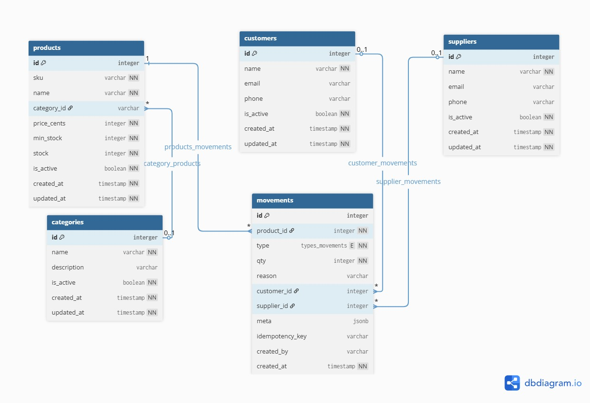

# 📑 MINI STOCK SYSTEM

Mini Stock System es una aplicación desarrollada con Spring Boot 3, pensada para la gestión simple de inventarios.
Permite registrar productos, organizar categorías, manejar proveedores y clientes, y controlar los movimientos de entrada y salida de stock de manera clara y eficiente.

### ✨ Características principales
- CRUD completo de productos, clientes, proveedores y categorías. 
- Registro y consulta de movimientos de inventario (entradas/salidas). 
- Validaciones automáticas y persistencia con JPA/Hibernate. 
- Migraciones de base de datos gestionadas con Flyway. 
- Base de datos embebida H2 lista para pruebas rápidas.


## 🚀 Como usar este proyecto

### 1️⃣ Clona el repositorio:
```bash
git clone https://github.com/D-Chevez/mini-stock-stock/tree/main
```
### 2️⃣ Configura la base de datos y archivos de propiedades:
El proyecto utiliza una base de datos H2 embebida por defecto, ideal para pruebas rápidas. 

Puedes cambiar la configuración de persistencia y otros parámetros editando los archivos de propiedades ubicados en:
- `src/main/resources/application.properties` (configuración principal)
- `src/main/resources/application-mysql.properties` (perfil de MySQL)

Para seleccionar el perfil de ejecución, declara la variable de entorno `SPRING_PROFILES_ACTIVE` antes de iniciar la aplicación. Ejemplo:
```bash
set SPRING_PROFILES_ACTIVE=mysql
mvn spring-boot:run
```
O desde tu IDE, configura la variable en la sección de ejecución.

**Nota sobre la persistencia:**
- El perfil `default` usan H2 embebido, los datos se pierden al reiniciar la aplicación.
- El perfil `mysql` puede configurarse para usar MySQL, manteniendo los datos entre reinicios.

Ajusta los parámetros de conexión, usuario y contraseña según tu entorno y necesidades en el archivo correspondiente.

### 3️⃣ Ejecuta la aplicación:
Desde tu IDE (IntelliJ, Eclipse, etc.), ejecuta la clase principal `org.kodigo.mini-stock-system.MiniStockApplication`. 
Alternativamente, puedes compilar y ejecutar con Maven:
```bash
mvn spring-boot:run
```

### 4️⃣ Accede a la API:
La aplicación expone una API RESTful. Puedes interactuar con ella usando herramientas como Postman o cURL. 
La documentación de la API está disponible en `http://localhost:8080/swagger-ui.html` (si Swagger está configurado).

---

## 🛠 Technologies
✅ Java 17+  
✅ Spring Boot 3  
✅ IntelliJ IDEA  
✅ Maven  
✅ JPA/Hibernate  
✅ H2 Database (embebida)  
✅ MySql  
✅ Flyway para migraciones de base de datos  
✅ Postman/Insomnia para pruebas de API  
✅ Swagger para documentación de API  
✅ Git & GitHub para control de versiones  

---

## 🗂️ Estructura del proyecto
Esta aplicación sigue una estructura estándar de proyecto Spring Boot,
implementando buenas practicas, como CLEAN CODE y principios SOLID.
El proyecto utiliza una arquitectura MVC (Modelo-Vista-Controlador) para
separar las responsabilidades y mejorar la mantenibilidad del código. Por lo tanto,
la estructura del proyecto es la siguiente:  

```
mini-stock-system
│
├── src
│   ├── main
│   │   ├── java
│   │   │   └── org.kodigo.mini-stock-system
│   │   │       ├── model                       # Entidades JPA
│   │   │       ├── repository                  # Repositorios JPA
│   │   │       ├── service                     # Lógica de negocio
│   │   │       ├── web
│   │   │       │   ├── controller              # Controladores REST
│   │   │       │   └── dto                     # Objetos de transferencia de datos
│   │   │       └── MiniStockApplication.java   # Clase principal
│   │   └── resources
│   │       ├── application.properties          # Configuraciones de la aplicación
│   │       └── db
│   │           └── migration                   # Scripts de migración Flyway
│   └── test                                    # Pruebas unitarias e integradas
│
└── pom.xml                                    # Configuración de Maven
```

Acontinuación se visualiza un diagrama de entidad-relación (ER) que representa el modelo
de datos y las relaciones entre las entidades principales del sistema.
Este diagrama facilita la comprensión del modelo de datos y cómo interactúan los diferentes
componentes de la aplicación.  



### 📦 Módulo de Productos

- `GET` - **/api/products**  
Lista todos los productos.
  - Respuesta:  
  `[ { id, name, price, stock, ... } ]`
- `GET` - **/api/products/{id}**  
Obtiene un producto por ID.
  - Respuesta:  
  `{ id, name, price, stock, ... }`
  - Errores: `404 Not Found` si el producto no existe.
- `POST` - **/api/products**  
Crea un nuevo producto.
  - Request:  
  `{ name, price, stock, ... }`
  - Respuesta: Producto creado `{ id, ... }`
  - Errores: `400 Bad Request` por datos inválidos.
- `PUT` - **/api/products/{id}**  
Actualiza un producto existente.
  - Request:  
  `{ name, price, stock, ... }`
  - Respuesta: Producto actualizado `{ id, ... }`
  - Errores: `404 Not Found`, `400 Bad Request`.
- `DELETE` - **/api/products/{id}**  
Elimina un producto.
  - Respuesta: `204 No Content`
  - Errores: `404 Not Found`.


### 🗂️ Módulo de Categorías
- `GET` - **/api/categories**  
Lista todas las categorías.
  - Respuesta:  
  `[ { id, name, description, ... } ]`
- `GET` - **/api/categories/{id}**  
Obtiene una categoría por ID.
  - Respuesta:  
  `{ id, name, description, ... }`
  - Errores: `404 Not Found` si la categoría no existe.
- `POST` - **/api/categories**  
Crea una nueva categoría.
  - Request:  
  `{ name, description }`
  - Respuesta: Categoría creada `{ id, ... }`
  - Errores: `400 Bad Request` por datos inválidos.
- `PUT` - **/api/categories/{id}**  
Actualiza una categoría existente.
  - Request:  
  `{ name, description }`
  - Respuesta: Categoría actualizada `{ id, ... }`
  - Errores: `404 Not Found`, `400 Bad Request`.
- `DELETE` - **/api/categories/{id}**  
Elimina una categoría.
  - Respuesta: `204 No Content`
  - Errores: `404 Not Found`.


### 👤 Módulo de Clientes
- `GET` - **/api/customers**  
Lista todos los clientes.
  - Respuesta:  
  `[ { id, name, email, phone, ... } ]`
- `GET` - **/api/customers/{id}**  
Obtiene un cliente por ID.
  - Respuesta:  
  `{ id, name, email, phone, ... }`
  - Errores: `404 Not Found` si el cliente no existe.
- `POST` - **/api/customers**  
Crea un nuevo cliente.
  - Request:  
  `{ name, email, phone }`
  - Respuesta: Cliente creado `{ id, ... }`
  - Errores: `400 Bad Request` por datos inválidos.
- `PUT` - **/api/customers/{id}**  
Actualiza un cliente existente.
  - Request:  
  `{ name, email, phone }`
  - Respuesta: Cliente actualizado `{ id, ... }`
  - Errores: `404 Not Found`, `400 Bad Request`.
- `DELETE` - **/api/customers/{id}**  
Elimina un cliente.
  - Respuesta: `204 No Content`
  - Errores: `404 Not Found`.

### 🏢 Módulo de Proveedores
- `GET` - **/api/suppliers**  
Lista todos los proveedores.
  - Respuesta:  
  `[ { id, name, contact, ... } ]`
- `GET` - **/api/suppliers/{id}**  
Obtiene un proveedor por ID.
  - Respuesta:  
  `{ id, name, contact, ... }`
  - Errores: `404 Not Found` si el proveedor no existe.
- `POST` - **/api/suppliers**  
Crea un nuevo proveedor.
  - Request:  
  `{ name, contact }`
  - Respuesta: Proveedor creado `{ id, ... }`
  - Errores: `400 Bad Request` por datos inválidos.
- `PUT` - **/api/suppliers/{id}**  
Actualiza un proveedor existente.
  - Request:  
  `{ name, contact }`
  - Respuesta: Proveedor actualizado `{ id, ... }`
  - Errores: `404 Not Found`, `400 Bad Request`.
- `DELETE` - **/api/suppliers/{id}**  
Elimina un proveedor.
  - Respuesta: `204 No Content`
  - Errores: `404 Not Found`.

### 🧮 Módulo de Movimientos de Inventario
- `GET` - **/api/movements**  
Lista todos los movimientos de inventario.
  - Respuesta:  
  `[ { id, productId, quantity, type, date, ... } ]`
- `GET` - **/api/movements/{id}**  
Obtiene un movimiento por ID.
  - Respuesta:  
  `{ id, productId, quantity, type, date, ... }`
  - Errores: `404 Not Found` si el movimiento no existe.
- `POST` - **/api/movements**  
Registra un nuevo movimiento (entrada/salida).
  - Request:  
  `{ productId, quantity, type, date }`
  - Respuesta: Movimiento creado `{ id, ... }`
  - Errores: `400 Bad Request`, `404 Not Found` (producto no existe).
- `DELETE` - **/api/movements/{id}**  
Elimina un movimiento.
  - Respuesta: `204 No Content`
  - Errores: `404 Not Found`.

---

## 🎨 Swagger UI
La aplicación incluye Swagger UI para documentar y probar la API REST de manera interactiva.
Una vez que la aplicación esté en ejecución, puedes acceder a Swagger UI en:
```
http://server:port/swagger-ui.html
```
Desde esta interfaz, puedes explorar los diferentes endpoints disponibles, ver los detalles de las solicitudes y respuestas,
y realizar pruebas directamente desde el navegador.

---

## Autores
- 🚀 **Programador:** [Diego Chevez](https://github.com/D-Chevez)
- 🚀 **Programador:** [Nicole Sanchez](https://github.com/nicolenohemysanchez)
- 🚀 **Programador:** [Roberto Mendez](https://github.com/romendezs)
